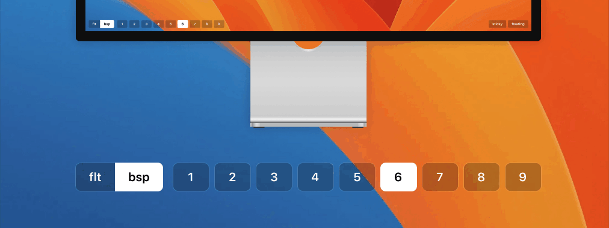
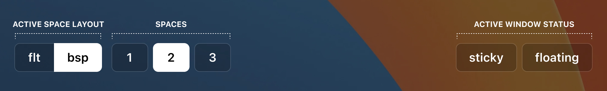

# Nero



Nero is a [Übersicht](http://tracesof.net/uebersicht) widget to monitor the state of [Yabai](https://github.com/koekeishiya/yabai/) tiling window manager.

## Table of Contents
- [Requirements](#requirements)
- [Installation](#installation)
- [Usage](#usage)
- [Customization](#customization)
- [Notes](#notes)
- [License](#license)
- [Contacts](#contacts)


## Requirements
- https://github.com/koekeishiya/yabai
- http://tracesof.net/uebersicht


## Installation

**CLI**
```shell
git clone http://github.com/lucaorio/nero
ln -s nero ~/Library/Application\ Support/Übersicht/widgets/nero
```

**Manual**
- Download the [latest version](https://github.com/lucaorio/nero/releases/latest)
- Unzip it
- Copy `nero` to the `~/Library/Application\ Support/Übersicht/widgets` directory


## Usage

Nero follows macOS's appearance and switches between light/dark mode automatically. If the colors do not work well with your wallpaper, take a look at the [customization](#customization) section.

As of now, Nero provides multi-monitor indicators for:
- Current layout (`bsp` vs. `flt`) of the active space
- All spaces available (and the active one)
- Current status (`sticky` and `floating`) of the active window



The widgets do not refresh periodically to preserve battery life and stay as reactive as possible. The re-rendering should be triggered by relying on [Yabai's own signals](https://github.com/koekeishiya/yabai/wiki/Commands#automation-with-rules-and-signals) and the activation method / hotkey utility of choice.

**Example**:
As an example, the `refresh-uebersicht.sh` file below contains a simple osascript to refresh the widgets:
```shell
osascript -e "tell application id \"tracesOf.Uebersicht\" to refresh widget id \"nero-yabai-jsx\""
```

The shell file is run from within Yabai own config `yabairc` file, by listening to various signals...
```shell
yabai -m signal --add event=space_changed action="refresh-uebersicht.sh"
yabai -m signal --add event=window_focused action="refresh-uebersicht.sh"
yabai -m signal --add event=application_activated action="refresh-uebersicht.sh"
```

...and also whenever one of the commands below are triggered via Karabiner, or skhd, etc.
- `yabai -m space --create && ~/.config/yabai/refresh-uebersicht.sh`
- `yabai -m space --layout float && ~/.config/yabai/refresh-uebersicht.sh`
- `yabai -m space --layout bsp && ~/.config/yabai/refresh-uebersicht.sh`
- `yabai -m space --move prev && ~/.config/yabai/refresh-uebersicht.sh`
- `yabai -m space --move next && ~/.config/yabai/refresh-uebersicht.sh`
- `yabai -m window --toggle float && ~/.config/yabai/refresh-uebersicht.sh`
- `yabai -m window --toggle sticky && ~/.config/yabai/refresh-uebersicht.sh`


## Customization

It's difficult to replicate the translucency effect of macOS native menubar because [Übersicht does not play well](https://github.com/felixhageloh/uebersicht/issues?q=is%3Aissue+backdrop-filter) with the `mix-blend-mode` and `backdrop-filter` CSS properties. Because of that, there are a couple of objects and a variable to customize the widgets quickly for those cases in which they don't look great with a particular wallpaper:
- You can manually set the `forcedTheme` variable to prevent the theme from changing
- You can tweak the `lightTheme` or `darkTheme` objects to customize the appearance

```js
const forcedTheme = false // false, 'dark', or 'light'

const lightTheme = {
// regular indicators
txtColor: 'rgba(255, 255, 255, 1)',
bgColor: 'rgba(0, 0, 0, 0.2)',
borderWidth: '1px',
borderColor: 'rgba(255, 255, 255, 0.2)',

// active indicators
txtColorActive: 'rgba(29, 36, 26, 1)',
bgColorActive: 'rgba(255, 255, 255, 1)',
borderWidthActive: '1px',
borderColorActive: 'rgba(255, 255, 255, 1)',
}

// darkTheme ...
```

It is up to personal taste, but Nero works best when a bottom padding is defined in the `yabairc` config file:
```shell
yabai -m config bottom_padding 54
```


## Notes

The first version of Nero was meant to replace macOS menubar and add a few additional indicators. It also included a widget for Yabai and a theme for [Alfred](https://alfredapp.com/).

With this version, I'm taking an entirely different approach and focus on Yabai, which seems to be the main reason why people discovered this repo in the first place:
- The Alfred theme has been moved to [alfred-theme-nero](https://github.com/lucaorio/alfred-theme-nero). The repository is available for whoever needs it, but it won't be updated anymore (as a note, I am currently using [Raycast](https://raycast.com/).)
- The indicators for macOS have been removed because quick, periodic refreshing of Übersicht widgets was a real drag on the battery.


## License


## Contacts

- Mastodon: [@lucaorio](http://mastodon.design/@lucaorio)
- Twitter: [@lucaorio_](http://twitter.com/@lucaorio_)
- Website: [lucaorio.com](http://lucaorio.com)
- Email: [luca.o@me.com](mailto:luca.o@me.com)
