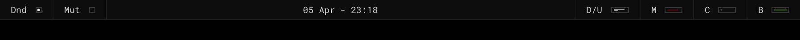
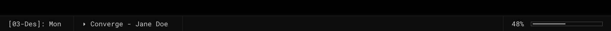
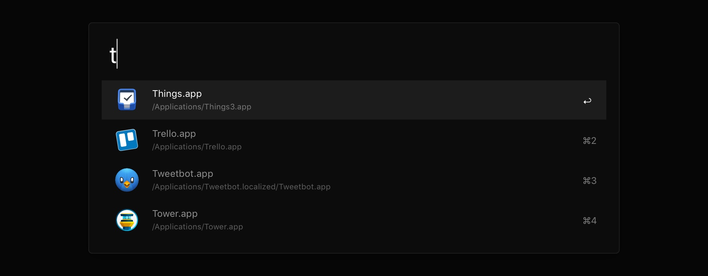

# Nero

Nero is a collection of [Übersicht](http://tracesof.net/uebersicht) widgets to replace the standard macOS menubar. It comes with an [Alfred](https://alfredapp.com/) theme.

> _(Italian) Nero -> (English) Black_

## Contents

- [Übersicht Widgets](#ubersicht-widgets)
- [Alfred Theme](#alfred-theme)
- [License](#license)
- [Contacts](#contacts)

## Übersicht Widgets
There are three different kind of menubars.

The **top** one is usable by anyone and works on any regular macOS installation. It comes in two version: **graphical**, or **textual**.




The **bottom** one has external dependencies, and it's useful just if you have a similar macOS setup.



Click any of the images above for an overview of the widgets available in a specific menubar.

### Rationale

Nero is a **distraction-less** alternative to the standard macOS menubar. Main sources of inspirations are [Neauoire](https://xxiivv.com/)'s [widgets](https://github.com/neauoire/ubersicht-widgets), and some other Linux menubars I've seen here and there.

This alternative menubars are **read-only** (not clickable) as I trigger everything via shortcuts.

I'm not planning to add interactions, icons, nor animations to these widgets, but feel free to customize them as you see fit. :)

### Requirements

- [Übersicht](http://tracesof.net/uebersicht)
- [Roboto Mono](https://fonts.google.com/specimen/Roboto+Mono)

### Installation

**CLI:**

```shell
$ git clone http://github.com/lucaorio/nero
$ cp -r nero/nero-top ~/Library/Application\ Support/Übersicht/widgets/nero-top
```
_Make sure to replace the 'nero-top' string with the desired version(s): nero-top, nero-top-text, and/or nero-bottom)_

**Manual**:

- Download the [latest version](https://github.com/lucaorio/nero/releases/latest)
- Unzip it
- Move the desired `nero-top`, `nero-top-text`, and/or `nero-bottom` folder(s) to your `Übersicht/widgets` directory

_Note: If Übersicht is draining your battery, consider increasing the `refreshFrequency` value available in every widget (or just disable the ones not needed)._

## Alfred Theme



### Requirements

- [Alfred](https://alfredapp.com)

### Installation

**CLI:**

```shell
$ git clone http://github.com/lucaorio/nero
$ open nero/nero-alfred/nero.alfredappearance
```

**Manual**:

- Download the [latest version](https://github.com/lucaorio/nero/releases/latest)
- Unzip it
- Open the `nero-alfred` folder, and double-click `nero.alfredappearance`

## License


## Contacts

- 🐦 Twitter [@lucaorio](http://twitter.com/@lucaorio_)
- 🕸 Website [lucaorio.com](http://lucaorio.com)
- 📬 Email [luca.o@me.com](mailto:luca.o@me.com)
