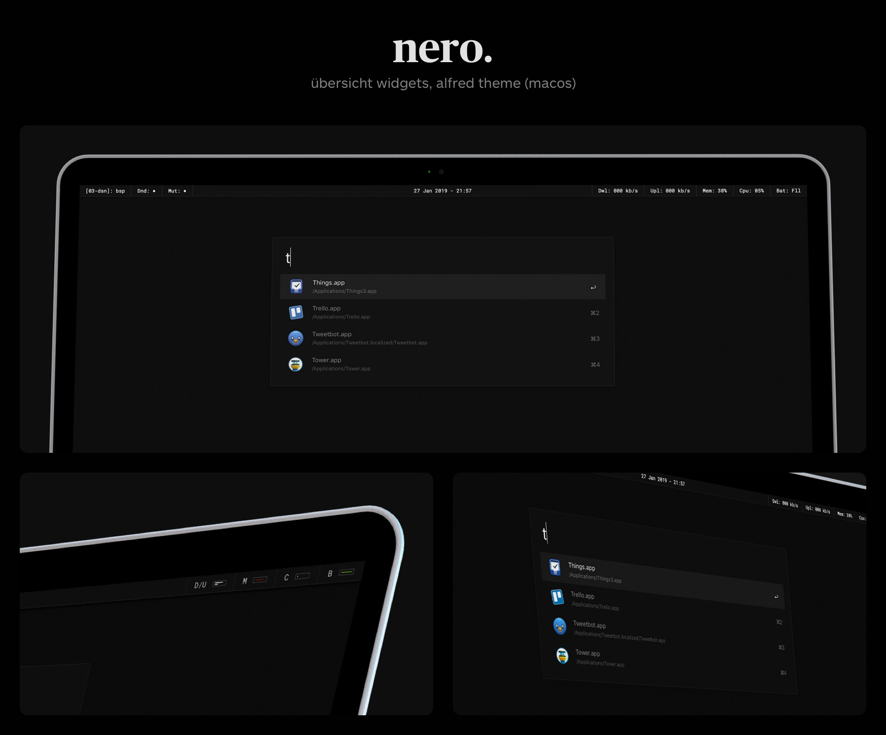
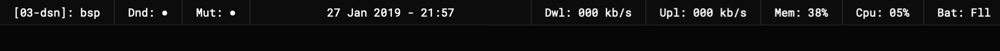

# Nero

Nero is a collection of [Übersicht](http://tracesof.net/uebersicht) widgets to replace the standard macOS menubar. It comes with an [Alfred](https://alfredapp.com/) theme.

> _(Italian) Nero -> (English) Black_

## Contents

- [Übersicht Widgets](#ubersicht-widgets)
- [Alfred Theme](#alfred-theme)
- [License](#license)
- [Contacts](#contacts)

## Übersicht Widgets



### Rationale

Nero is a **distraction-less** alternative to the standard macOS menubar. Main sources of inspirations are [Neauoire](https://xxiivv.com/)'s [widgets](https://github.com/neauoire/ubersicht-widgets), and some other Linux menubars I've seen here and there.

This alternative menubar is **read-only** (not clickable) as I trigger volume controls, do no disturb, space switching, and chunkwm mode via shortcuts.

I'm not planning to add interactions, icons, nor animations to these widgets, but feel free to customize them as you see fit. :)

### Requirements

- Overall collection: [Übersicht](http://tracesof.net/uebersicht), [Roboto Mono](https://fonts.google.com/specimen/Roboto+Mono)
- _Chunkwm/Spaces_ widget: [chunkwm](https://github.com/koekeishiya/chunkwm)

### Installation

**CLI:**

```shell
$ git clone http://github.com/lucaorio/nero
$ cp nero/nero.widgets ~/Library/Application\ Support/U<0308>bersicht/widgets/nero.widgets
```

**Manual**:

- Download the repository
- Unzip `nero.widget.zip`
- Move the `nero.widget` folder to your `Übersicht/widgets` directory

_Note: If Übersicht is consuming too much battery, consider changing the `refreshFrequency` value available in every widget (or just disable the not needed ones)._

### Widgets

**Chunkwm / macOS spaces**

Provides current macOS _space_ ID and name, and _chunkwm_ layout mode.

Examples: `[04-cod]: bsp` / `[01-term]: mon` / `[01-ukw]: flo`

Amount of spaces, and their name can be customized in `chunkwm.sh`.

**Do Not Disturb**

Provides current status of macOS's _Do Not Disturb_ feature.

Examples: `Dnd: ○` (off) / `Dnd: ●` (on)

**Mute**

Provides current status of macOS's _Mute_ feature.

Examples: `Mut: ○` (off) / `Mut: ●` (on)

**Clock**

Provides current _date_, and _time_.

Example: `29 Jan 2019 - 23:13`

Tweak the shell script in `clock.jsx` to get an AM/PM format.

**Download/Upload Speed**

Provides current _download_, and _upload speeds_ every 5,000ms = 5s.

Examples: `Dwl: 020 kb/s` / `Upl: 1.3 mb/s`

**Memory**

Provides current _memory pressure_, every 30,000ms = 30s.

Examples: `Mem: 20%` / `Mem: !!!` (mem > 80%)

**Cpu**

Provides current _cpu load_, every 10,000ms = 10s.

Examples: `Cpu: 20%` / `Cpu: !!!` (cpu > 80%)

**Battery**

Provides current _battery status_, every 60,000ms = 60s.

Examples: `Bat: 56%` / `Bat: !!!` (battery < 6%) / `Bat: Fll` (full battery)

## Alfred Theme


### Requirements

- [Alfred](https://alfredapp.com)

### Installation

**CLI:**

```shell
$ git clone http://github.com/lucaorio/nero
$ open nero/nero.alfred/nero.alfredappearance
```

**Manual**:

- Download the repository
- Open `nero.alfred` folder, and double-click `nero.alfredappearance`

## License


## Contacts

- 🐦 Twitter [@lucaorio](http://twitter.com/@lucaorio_)
- 🕸 Website [lucaorio.com](http://lucaorio.com)
- 📬 Email [luca.o@me.com](mailto:luca.o@me.com)
