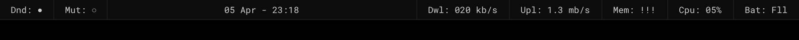

# Nero Top Text - Widgets

**Do Not Disturb**

Provides current status of macOS's _Do Not Disturb_ feature.

Examples: `Dnd: ○` (off) / `Dnd: ●` (on)

**Mute**

Provides current status of macOS's _Mute_ feature.

Examples: `Mut: ○` (off) / `Mut: ●` (on)

**Clock**

Provides current _date_, and _time_.

Example: `29 Jan - 23:13`

Tweak the shell script in `clock.jsx` to get an AM/PM format.

**Download/Upload Speed**

Provides current _download_, and _upload speeds_ every 5,000ms = 5s.

Examples: `Dwl: 020 kb/s` / `Upl: 1.3 mb/s`

**Memory**

Provides current _memory pressure_, every 30,000ms = 30s.

Examples: `Mem: 20%` / `Mem: !!!` (mem > 80%)

**Cpu**

Provides current _cpu load_, every 10,000ms = 10s.

Examples: `Cpu: 20%` / `Cpu: !!!` (cpu > 80%)

**Battery**

Provides current _battery status_, every 60,000ms = 60s.

Examples: `Bat: 56%` / `Bat: !!!` (battery < 6%) / `Bat: Fll` (full battery)
