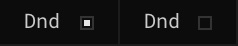
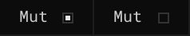
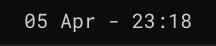
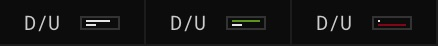
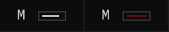
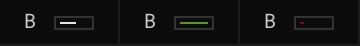

# Nero Top - Widgets

**Do Not Disturb**

Provides current status of macOS's _Do Not Disturb_ feature.

**Mute**

Provides current status of macOS's _Mute_ feature.

**Clock**

Provides current _date_, and _time_. Tweak the shell script in `clock.jsx` to get an AM/PM format.

**Download/Upload Speed**

Provides current _download_, and _upload speeds_ every 5,000ms = 5s.

Download/Upload:
- From `0 kb/s` to `999 kb/s` [white]
- From `1 mb/s` [green/red]

**Memory**

Provides current _memory pressure_, every 30,000ms = 30s.

- From `0%` to `80%` [white]
- From `80%` to `100%` [red]

**Cpu**

Provides current _cpu load_, every 10,000ms = 10s.

- From `0%` to `80%` [white]
- From `80%` to `100%` [red]

**Battery**

Provides current _battery status_, every 60,000ms = 60s.

- From `0%` to `6%` [red]
- From `7%` to `99%` [white]
- `100%` [green]

